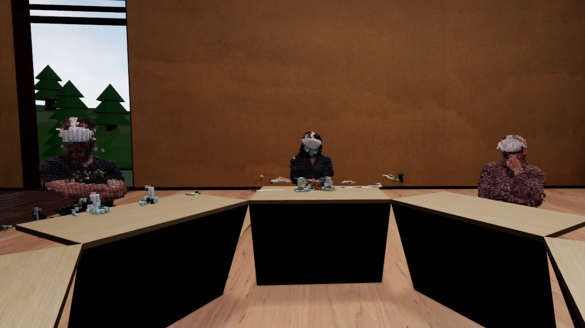

# VIMR Telepresence



Tele-co-presence with live peer-to-peer volumetric video streams representing each user. You will need:

- Unreal Engine 5.3
- A camera (RealSense, or a webcam can be used for testing)
- Optionally a 3DConnexion SpaceMouse

This includes these plugins:

  - AdvancedSessions
  - SpaceMouse
  - VIMRUE5

You will also need to install [3DxWare](https://3dconnexion.com/drivers/) for SpaceMouse support (even if you don't use one), and make sure that the TDxUnrealEditor plugin is installed

This project works over LAN, to run tele-co-presence over the internet you'll need AdvancedSteamSessions and you'll need to update the `DefaultEngine.ini` to use steam.


## Citation

```bibtex
@article{duncan2021voxelbased,
    author = {Duncan, Stuart and Park, Noel and Ott, Claudia and Langlotz, Tobias and Regenbrecht, Holger Regenbrecht},
    title = {Voxel-Based Immersive Mixed Reality: A Framework for Ad Hoc Immersive Storytelling},
    journal = {PRESENCE: Virtual and Augmented Reality},
    volume = {30},
    pages = {5-29},
    year = {2021},
    month = {12},
    issn = {1054-7460},
    doi = {10.1162/pres_a_00364},
}
```